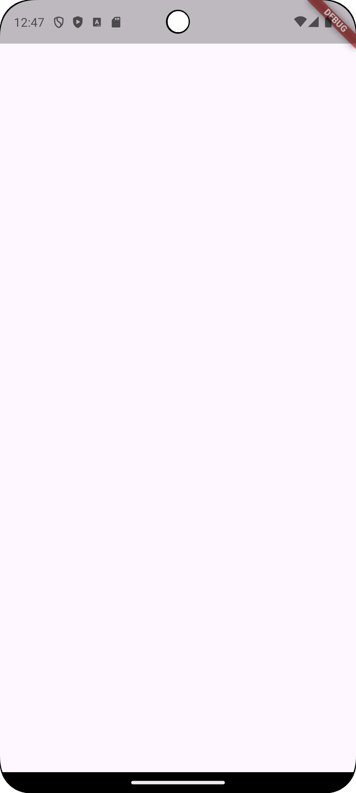

# 주차 기록

날짜: 2025년 10월 30일
진도: 섹션 9: 74~83번 강의
키워드: .WAV, Dart, Library, Packages

<aside>


**What’s the point?**

- 외부 Package를 도입하는 방법에 대해 학습
    
    [audioplayers install | Flutter package](https://pub.dev/packages/audioplayers/install)
    

---

</aside>

<aside>


# Section 9 Xylophone - Using Flutter and Dart Packages to Speed Up Development

</aside>

## 74. Xylophone - A simple Musical Instrument App

---

1️⃣ https://github.com/woojin-devv/xylophone 클론 받아오기

2️⃣ `Get Dependencies` 눌러주고 Flutter 프로젝트 시작하기

3️⃣ `assets` 폴더 안에 있는 실로폰 음성 파일 확인, `pubspec.yaml`의 연결 확인

```yaml
**flutter:**
  uses-material-design: true
  **assets:
    - assets/**
```

4️⃣ 실행 확인하기



## 75. What are Flutter & Dart Packages?

---

0️⃣ https://pub.dev/ 에서 사용 가능한 패키지를 찾아 볼 수 있다

1️⃣ 동일한 동작을 하는 packages 중 가장 점수가 높은 package 사용하는 것이 좋다

2️⃣ package를 프로젝트 안에 불러 오기

**1 ) 의존성 추가**

https://pub.dev/packages/english_words/install

```yaml
**# pubspec.yaml**
dependencies:
  flutter:
    sdk: flutter

  # The following adds the Cupertino Icons font to your application.
  # Use with the CupertinoIcons class for iOS style icons.
  cupertino_icons: ^1.0.8
  **english_words: ^4.0.0**
```

**2 ) package 설치**

**`Pub get`** 을 통해 package 설치


**3 ) package 임포트**

<aside>


**`import 'package:english_words/english_words.dart';`**

</aside>

3️⃣ package 사용하기

```dart
**/*main.dart*/**
import 'package:flutter/material.dart';
**import 'package:english_words/english_words.dart';**

void main() {
  runApp(const Xylophone());
}

class Xylophone extends StatelessWidget {
  const Xylophone({super.key});

  @override
  Widget build(BuildContext context) {
    return MaterialApp(
      home: Scaffold(
        body: SafeArea(
            child: Center(child: **Text(adjectives.last)**),
        ),
      ),
    );
  }
}
```


<aside>

**`External Libraries`에 설치된 패키지 파일을 열면, 어떤 부분을 사용할 수 있는지 알 수 있다!**

```dart
**child: Center(child: Text(nouns.first))**
```

```dart
**child: Center(child: Text(adjectives.first))**
```

```dart
**child: Center(child: Text(all.first))**
```


</aside>

## 76. How to play Sound Across Platforms

---

**⬆️ 위 과정과 동일하게 해당 패키지를 import!**

https://pub.dev/packages/audioplayers/install

**1️⃣&2️⃣ package 불러 오기**

**3️⃣ package 사용하기**

[https://github.com/bluefireteam/audioplayers/blob/main/getting_started.md](https://github.com/bluefireteam/audioplayers/blob/main/getting_started.md)

⬆️ local assets를 불러오기 위해서 README.MD의 Advanced Concepts/AudioCache 부분 참고!

```dart
**// main.dart
import 'package:audioplayers/audioplayers.dart';**
import 'package:flutter/material.dart';

void main() {
  runApp(const Xylophone());
}

class Xylophone extends StatelessWidget {
  const Xylophone({super.key});

  @override
  Widget build(BuildContext context) {
    return MaterialApp(
      home: Scaffold(
        body: SafeArea(
            child: Center(**child: TextButton(onPressed: (){
              final player = AudioPlayer();
              player.play(AssetSource('note1.wav'));
            }, child: Text('Click Me!'))),**
        ),
      ),
    );
  }
}
```

<aside>


**AudioCache**

➡️ Flutter에서 local에 있는 audio asset에 접근하기 쉽지 않으므로, 이 패키지를 이용하자!

---

**Local Assets**

➡️ Local Assets에서는 기본적으로 파일 경로 명을 `assets/`로 가정

e.g. `note1.wav`가 `assets` 폴더 바로 아래에 있다면

⇒ `player.play(AssetSource('note1.wav'))`

`'assets/note1.wav'` 라고 하면, `note1.wav`는 `assets` 폴더 아래 `assets`폴더 아래에 있는 것이 되므로 주의!

```dart
**final player = AudioPlayer();
player.play(AssetSource('audio/my-audio.wav'));**
```

</aside>

## 77. How to Play Multiple Sounds

---

```dart
**// main.dart**
import 'package:audioplayers/audioplayers.dart';
import 'package:flutter/material.dart';

void main() {
  runApp(const Xylophone());
}

class Xylophone extends StatelessWidget {
  const Xylophone({super.key});

  @override
  Widget build(BuildContext context) {
    return MaterialApp(
      home: Scaffold(
        body: SafeArea(
          **child: Column(
            children: [
              TextButton(
                style: ButtonStyle(backgroundColor: WidgetStateProperty.all(Colors.red)),
                onPressed: (){
                  final player = AudioPlayer();
                  player.play(AssetSource('note1.wav'));
                },
                child: Text('1')
              ),
              TextButton(
                  style: ButtonStyle(backgroundColor: WidgetStateProperty.all(Colors.orange)),
                  onPressed: (){
                    final player = AudioPlayer();
                    player.play(AssetSource('note2.wav'));
                  },
                  child: Text('2')
              ),
              TextButton(
                  style: ButtonStyle(backgroundColor: WidgetStateProperty.all(Colors.yellow)),
                  onPressed: (){
                    final player = AudioPlayer();
                    player.play(AssetSource('note3.wav'));
                  },
                  child: Text('3')
              ),
              TextButton(
                  style: ButtonStyle(backgroundColor: WidgetStateProperty.all(Colors.greenAccent)),
                  onPressed: (){
                    final player = AudioPlayer();
                    player.play(AssetSource('note4.wav'));
                  },
                  child: Text('4')
              ),
              TextButton(
                  style: ButtonStyle(backgroundColor: WidgetStateProperty.all(Colors.green)),
                  onPressed: (){
                    final player = AudioPlayer();
                    player.play(AssetSource('note5.wav'));
                  },
                  child: Text('5')
              ),
              TextButton(
                  style: ButtonStyle(backgroundColor: WidgetStateProperty.all(Colors.blue)),
                  onPressed: (){
                    final player = AudioPlayer();
                    player.play(AssetSource('note6.wav'));
                  },
                  child: Text('6')
              ),
              TextButton(
                  style: ButtonStyle(backgroundColor: WidgetStateProperty.all(Colors.purple)),
                  onPressed: (){
                    final player = AudioPlayer();
                    player.play(AssetSource('note7.wav'));
                  },
                  child: Text('7')
              ),
            ],
          ),**
        ),
      ),
    );
  }
}
```

---

**함수로 코드 정리하기**

```dart
**void playSound(int noteNumber) {
  final player = AudioPlayer();
  player.play(AssetSource('note$noteNumber.wav'));
}**
```

```dart
**// main.dart**
import 'package:audioplayers/audioplayers.dart';
import 'package:flutter/material.dart';

void main() {
  runApp(const Xylophone());
}

class Xylophone extends StatelessWidget {
  const Xylophone({super.key});

  void playSound(int noteNumber) {
    final player = AudioPlayer();
    player.play(AssetSource('note$noteNumber.wav'));
  }

  @override
  Widget build(BuildContext context) {
    return MaterialApp(
      home: Scaffold(
        body: SafeArea(
          child: Column(
            children: [
              TextButton(
                style: ButtonStyle(backgroundColor: WidgetStateProperty.all(Colors.red)),
                **onPressed: (){
                  playSound(1);
                },**
                child: Text('1')
              ),
              TextButton(
                  style: ButtonStyle(backgroundColor: WidgetStateProperty.all(Colors.orange)),
                  **onPressed: (){
                    playSound(2);
                  },**
                  child: Text('2')
              ),
              TextButton(
                  style: ButtonStyle(backgroundColor: WidgetStateProperty.all(Colors.yellow)),
                  **onPressed: (){
                    playSound(3);
                  },**
                  child: Text('3')
              ),
              TextButton(
                  style: ButtonStyle(backgroundColor: WidgetStateProperty.all(Colors.greenAccent)),
                  **onPressed: (){
                    playSound(44);
                  },**
                  child: Text('4')
              ),
              TextButton(
                  style: ButtonStyle(backgroundColor: WidgetStateProperty.all(Colors.green)),
                  **onPressed: (){
                    playSound(5);
                  },**
                  child: Text('5')
              ),
              TextButton(
                  style: ButtonStyle(backgroundColor: WidgetStateProperty.all(Colors.blue)),
                  **onPressed: (){
                    playSound(6);
                  },**
                  child: Text('6')
              ),
              TextButton(
                  style: ButtonStyle(backgroundColor: WidgetStateProperty.all(Colors.purple)),
                  **onPressed: (){
                    playSound(7);
                  },**
                  child: Text('7')
              ),
            ],
          ),
        ),
      ),
    );
  }
}
```

## 78. [Dart] Functions - Part2

---

**Creating the Function**

```dart
void getMilk (**int bottles**) {
	double cost = bottles * 1.5
}
```

<Input을 줄 때>

1. Data Type 명시
2. Name 설정

**Calling the Function**

```dart
getMilk(**2**);
```

```dart
void getMilk (**int bottles = 2**) {
	double cost = bottles * 1.5;
}
```

---

```dart
void main() {
	greet('Jack');
}

void greet(String personToGreet) {
	print('Hello, $personToGreet');
}

// Hello, Jack
```

---

**여러 개의 input 넣기**

```dart
void main() {
	greet(greeting: 'How do you do?', personToGreet: 'Jackie');
}

void greet({String personToGreet, String greeting}) {
	print('$greeting $personToGreet')
}
```

## 79. Updating the UI of Our App

---

```dart
import 'package:audioplayers/audioplayers.dart';
import 'package:flutter/material.dart';

void main() {
  runApp(const Xylophone());
}

class Xylophone extends StatelessWidget {
  const Xylophone({super.key});

  void playSound(int noteNumber) {
    final player = AudioPlayer();
    player.play(AssetSource('note$noteNumber.wav'));
  }

  @override
  Widget build(BuildContext context) {
    return MaterialApp(
      home: Scaffold(
        **backgroundColor: Colors.black,**
        body: SafeArea(
          child: Column(
            **crossAxisAlignment: CrossAxisAlignment.stretch,**
            children: [
              Expanded(
                child: TextButton(
                    style: ButtonStyle(backgroundColor: WidgetStateProperty.all(Colors.red)),
                    onPressed: (){
                      playSound(1);
                    },
                    child: Text('1')
                ),
              ),
              Expanded(
                child: TextButton(
                    style: ButtonStyle(backgroundColor: WidgetStateProperty.all(Colors.orange)),
                    onPressed: (){
                      playSound(2);
                    },
                    child: Text('2')
                ),
              ),
              Expanded(
                child: TextButton(
                    style: ButtonStyle(backgroundColor: WidgetStateProperty.all(Colors.yellow)),
                    onPressed: (){
                      playSound(3);
                    },
                    child: Text('3')
                ),
              ),
              Expanded(
                child: TextButton(
                    style: ButtonStyle(backgroundColor: WidgetStateProperty.all(Colors.greenAccent)),
                    onPressed: (){
                      playSound(44);
                    },
                    child: Text('4')
                ),
              ),
              Expanded(
                child: TextButton(
                    style: ButtonStyle(backgroundColor: WidgetStateProperty.all(Colors.green)),
                    onPressed: (){
                      playSound(5);
                    },
                    child: Text('5')
                ),
              ),
              Expanded(
                child: TextButton(
                    style: ButtonStyle(backgroundColor: WidgetStateProperty.all(Colors.blue)),
                    onPressed: (){
                      playSound(6);
                    },
                    child: Text('6')
                ),
              ),
              Expanded(
                child: TextButton(
                    style: ButtonStyle(backgroundColor: WidgetStateProperty.all(Colors.purple)),
                    onPressed: (){
                      playSound(7);
                    },
                    child: Text('7')
                ),
              ),
            ],
          ),
        ),
      ),
    );
  }
}

```

---

`Expanded()`가 포함하고 있는 부분이 반복되므로 ⇒ 하나의 함수로 refactoring!

```dart
**void buildKey() {
  Expanded(
    child: TextButton(
        style: ButtonStyle(backgroundColor: WidgetStateProperty.all(Colors.red)),
        onPressed: (){
          playSound(1);
        },
        child: Text('1'),
    ),
  );
}**
```

## 80. [Dart] Functions - Part3

---

**Creating the Function**

```dart
int getMilk(int money) {
	return money - 2;
}
```

**Calling the Function**

```dart
int change = getMilk(5);
```

## 81. [Dart] Functions Challenge

---

```dart
void main() {
	int step1Result = add(n1:5, n2:9);
	int step2Result = multiply(step1Result, 5);
	double finalResult = step2Result / 3;
	print(finalResult);
}

int add(int n1, int n2) {
	return n1 + n2;
}

int multiply(int n1, int n2) {
	return n1 * n2;
}
```

## 82. Refactoring Our App

---

```dart
import 'package:audioplayers/audioplayers.dart';
import 'package:flutter/material.dart';

void main() {
  runApp(const Xylophone());
}

class Xylophone extends StatelessWidget {
  const Xylophone({super.key});

  void playSound(int noteNumber) {
    final player = AudioPlayer();
    player.play(AssetSource('note$noteNumber.wav'));
  }

  **Expanded buildKey({Color color=Colors.white, int noteNumber=1}) {
    return Expanded(
      child: TextButton(
          style: ButtonStyle(backgroundColor: WidgetStateProperty.all(color)),
          onPressed: (){
            playSound(noteNumber);
          },
          child: Text('1'),
      ),
    );
  }**

  @override
  Widget build(BuildContext context) {
    return MaterialApp(
      home: Scaffold(
        backgroundColor: Colors.black,
        body: SafeArea(
          child: Column(
            crossAxisAlignment: CrossAxisAlignment.stretch,
            children: <Widget>[
              **buildKey(color: Colors.red, noteNumber: 1),
              buildKey(color: Colors.orange, noteNumber: 2),
              buildKey(color: Colors.yellow, noteNumber: 3),
              buildKey(color: Colors.greenAccent, noteNumber: 4),
              buildKey(color: Colors.green, noteNumber: 5),
              buildKey(color: Colors.blue, noteNumber: 6),
              buildKey(color: Colors.purple, noteNumber: 7),**
            ],
          ),
        ),
      ),
    );
  }
}

```

## 83. [Dart] Arrow Functions

---

**== `lambda function`**

```dart
void main() {
	int result =  add();
	print(result);
}

int add() {
	return 5 + 2;
}
```

```dart
void main() {
	int result =  add();
	print(result);
}

**int add() => 5 + 2;**
```

<aside>
⚠️

함수에서 실행하고자 하는 코드가 한 줄 이상일 때는 사용 불가능

</aside>

**input parameter**

```dart
void main() {
	int result =  add(5, 2);
	print(result);
}

int add(**int n1, int n2**) {
	return n1 + n2;
}
```

```dart
void main() {
	int result =  add();
	print(result);
}

int add(**int n1, int n2**) => n1 + n2;
```

---

```dart
void main() {
	runApp(const Xylophone());
}
```

```dart
void main() => runApp(const Xylophone());

```

## 84. Customise It!

---

생략

---

```dart
**// main.dart

import 'package:audioplayers/audioplayers.dart';
import 'package:flutter/material.dart';

void main() => runApp(const Xylophone());

class Xylophone extends StatelessWidget {
  const Xylophone({super.key});

  void playSound(int noteNumber) {
    final player = AudioPlayer();
    player.play(AssetSource('note$noteNumber.wav'));
  }

  Expanded buildKey({Color color=Colors.white, int noteNumber=1}) {
    return Expanded(
      child: TextButton(
          style: ButtonStyle(backgroundColor: WidgetStateProperty.all(color)),
          onPressed: (){
            playSound(noteNumber);
          },
          child: Text('1'),
      ),
    );
  }

  @override
  Widget build(BuildContext context) {
    return MaterialApp(
      home: Scaffold(
        backgroundColor: Colors.black,
        body: SafeArea(
          child: Column(
            crossAxisAlignment: CrossAxisAlignment.stretch,
            children: <Widget>[
              buildKey(color: Colors.red, noteNumber: 1),
              buildKey(color: Colors.orange, noteNumber: 2),
              buildKey(color: Colors.yellow, noteNumber: 3),
              buildKey(color: Colors.greenAccent, noteNumber: 4),
              buildKey(color: Colors.green, noteNumber: 5),
              buildKey(color: Colors.blue, noteNumber: 6),
              buildKey(color: Colors.purple, noteNumber: 7),
            ],
          ),
        ),
      ),
    );
  }
}**
```