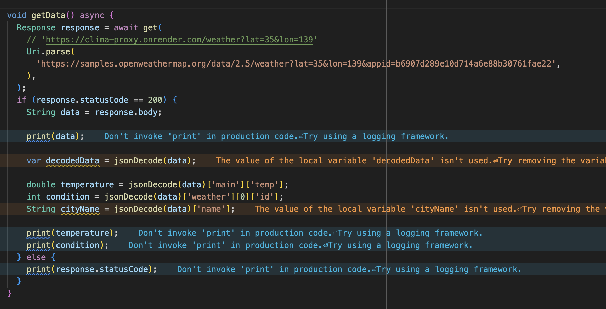

# 주차 기록

날짜: 2025년 11월 19일
진도: Section 13: 147~154
키워드: API, HTTP, Layout, Networking, Packages

<aside>


**What’s the point?**

 외부 API를 활용하여 앱을 연동하는 방법을 학습

[Current weather data](https://openweathermap.org/current)

[](https://samples.openweathermap.org/data/2.5/weather?lat=35&lon=139&appid=b6907d289e10d714a6e88b30761fae22)

- `open weather map`의 sample json을 호출할 수 있는 api

[](https://samples.openweathermap.org/data/2.5/weather?lat=35&lon=139&appid=b6907d289e10d714a6e88b30761fae22)

---

</aside>

# ☔ Section 13 Clima - Powering Your Flutter App with Live Web Data

---

<aside>


**proxy 서버**

→ base URL로 교체

```dart
**Uri.parse('https://clima-proxy.onrender.com/')**
```



</aside>

## 147. JSON Parsing and Dynamic Types

---

<aside>

### 🌈 API Providers

---

`mode`를 설정함으로써 어떤 형식으로 볼 것인지 설정 가능!

**XML**

---

```xml
<key>value</key>
```

e.g. `AndroidManifest.xml`

[**JSON**](https://chromewebstore.google.com/detail/json-viewer-pro/eifflpmocdbdmepbjaopkkhbfmdgijcc?pli=1)

---

```json
{key: value}
```

JSON을 인터넷으로 주고 받을 때, 정보를 최소화하여 전송하거나 받음 ⇒ 앱으로 받아올 때 unpack 필요

← `import 'dart:convert';`

- API sample JSON code
    
    ```json
    {
      "coord": {
        "lon": 139.01,
        "lat": 35.02
      },
      "weather": [
        {
          "id": 800,
          "main": "Clear",
          "description": "clear sky",
          "icon": "01n"
        }
      ],
      "base": "stations",
      "main": {
        "temp": 285.514,
        "pressure": 1013.75,
        "humidity": 100,
        "temp_min": 285.514,
        "temp_max": 285.514,
        "sea_level": 1023.22,
        "grnd_level": 1013.75
      },
      "wind": {
        "speed": 5.52,
        "deg": 311
      },
      "clouds": {
        "all": 0
      },
      "dt": 1485792967,
      "sys": {
        "message": 0.0025,
        "country": "JP",
        "sunrise": 1485726240,
        "sunset": 1485763863
      },
      "id": 1907296,
      "name": "Tawarano",
      "cod": 200
    }
    ```
    
</aside>

**`jsonDecode(source)`와 `key` 를 통해 JSON의 값을 읽어보자!**

```dart
if (response.statusCode == 200) {
	String data = response.body;
	print(data);
	
	**var longtitude = jsonDecode(data)['coord']['lon'];**
	print(longtitude);
	
	**// JSON의 list에 포함된 키 접근하기**
	**var weatherDescription = jsonDecode(data)['weather'][0]['description'];**
	print(weatherDescription);
	
	**var temperature = jsonDecode(data)['main']['temp'];
	var condition = jsonDecode(data)['weather'][0]['id'];
	var cityName = jsonDecode(data)['name'];**
}
```

‼️ [JSON Viewer Pro](https://chromewebstore.google.com/detail/json-viewer-pro/eifflpmocdbdmepbjaopkkhbfmdgijcc?pli=1)에서 요소 클릭 후 Copy Paste로 더 쉽게 경로 복사 가능!

```dart
if (response.statusCode == 200) {
	String data = response.body;
	print(data);
	
	**// 타입이 정해져 있지 않음!
	var decodedData = jsonDecode(data);**
	
	**double** temperature = **decodedData**['main']['temp'];
	**int** condition = **decodedData**['weather'][0]['id'];
	**String** cityName = **decodedData**['name'];
}
```

---

## 148. Getting Actual Weather Data from the OpenWeatherMap API

---

`Geolocator`을 통해 얻은 위치 정보를 바탕으로 **해당 위치의 현재 기상 데이터 얻기**

1️⃣ [OpenWeatherApp](https://openweathermap.org/current)에서 회원 가입 후 API > API keys로 진입

2️⃣ *own* API key를 Copy and Paste해서 새로운 변수 `apiKey` 생성

<aside>

`d7fea9ff17449560a56323c087e815cd`

</aside>

3️⃣ `appid`값을 `apiKey`로 대체

4️⃣ `latitude` 와 `longtitude`도 써왔던 변수로 대체

```dart
class _LoadingScreenState extends State<LoadingScreen> {

  double? latitude;
  double? longtitude;

  @override
  void initState() {
    super.initState();
    getLocation();
    getData();
  }

  void getLocation() async {
    Location location = Location();
    await location.getCurrentLocation();
    latitude = location.latitude;
    longtitude = location.longitude;
  }

  void getData() async {
    http.Response response = await http.get(
        Uri.parse('https://clima-proxy.onrender.com/data/2.5/weather?lat=$latitude&lon=$longtitude&appid=$apiKey'),
    );
    if (response.statusCode == 200) {
      String data = response.body;
      print(data);
    } else {
      print(response.statusCode);
    }
  }
```

5️⃣ `initState`에 있던 `getData()`를 `getLocation`으로 옮기기

```dart
  void getLocation() async {
    Location location = Location();
    await location.getCurrentLocation();
    latitude = location.latitude;
    longtitude = location.longitude;

    getData();
  }
```

⇒ `latitude`와 `longtitude`가 empty하지 않게!

```dart
// loading_screen.dart
import 'package:flutter/material.dart';
import 'package:clima/services/location.dart';
import 'package:http/http.dart' as http;
**import 'dart:convert';**

**const apiKey = 'd7fea9ff17449560a56323c087e815cd';**

class LoadingScreen extends StatefulWidget {
  const LoadingScreen({super.key});

  @override
  _LoadingScreenState createState() => _LoadingScreenState();
}

class _LoadingScreenState extends State<LoadingScreen> {

  **double? latitude;
  double? longtitude;**

  @override
  void initState() {
    super.initState();
    getLocation();
  }

  void getLocation() async {
    Location location = Location();
    await location.getCurrentLocation();
    **latitude = location.latitude;
    longtitude = location.longitude;

    getData();**
  }

  void getData() async {
    http.Response response = await http.get(
      **Uri.parse('https://clima-proxy.onrender.com/weather?lat=$latitude&lon=$longtitude')**
    );
    if (response.statusCode == 200) {
      String data = response.body;
      print(data);
    } else {
      print(response.statusCode);
    }
  }

  @override
  Widget build(BuildContext context) {
    return Scaffold(
      body: Center(
        child: ElevatedButton(
          onPressed: () {
            getLocation();
          },
          child: const Text('Get Location'),
        ),
      ),
    );
  }
}
```

```dart
import 'package:flutter/material.dart';
import 'package:clima/services/location.dart';
import 'package:clima/services/networking.dart';

const apiKey = 'd7fea9ff17449560a56323c087e815cd';

class LoadingScreen extends StatefulWidget {
  const LoadingScreen({super.key});

  @override
  _LoadingScreenState createState() => _LoadingScreenState();
}

class _LoadingScreenState extends State<LoadingScreen> {

  double? latitude;
  double? longtitude;

  @override
  void initState() {
    super.initState();
    getLocationData();
  }

  void getLocationData() async {
    Location location = Location();
    await location.getCurrentLocation();
    latitude = location.latitude;
    longtitude = location.longitude;

    NetworkHelper networkHelper = NetworkHelper('https://clima-proxy.onrender.com/weather?lat=$latitude&lon=$longtitude');

    var weatherData = await networkHelper.getData();
  }

  @override
  Widget build(BuildContext context) {
    return Scaffold(
      body: Center(
        child: ElevatedButton(
          onPressed: () {
            getLocationData();
          },
          child: const Text('Get Location'),
        ),
      ),
    );
  }
}
```

```dart
import 'package:http/http.dart' as http;
import 'dart:convert';

class NetworkHelper {

  NetworkHelper(this.url);

  final String url;

  Future getData() async {
    http.Response response = await http.get(Uri.parse(url));
    if (response.statusCode == 200) {
      String data = response.body;
      return jsonDecode(data);
    } else {
      print(response.statusCode);
    }
  }
}
```

---

## 149. Showing a Spinner While the User Waits

---

`loading_screen`과 `location_screen`의 부드러운 전환을 위해 **Spinner**을 사용해 보자!

1️⃣ `loading_screen.dart`에 `Navigator` 추가

```dart
class _LoadingScreenState extends State<LoadingScreen> {

  double? latitude;
  double? longtitude;

  @override
  void initState() {
    super.initState();
    getLocationData();
  }

  void getLocationData() async {
    Location location = Location();
    await location.getCurrentLocation();
    latitude = location.latitude;
    longtitude = location.longitude;

    NetworkHelper networkHelper = NetworkHelper('https://clima-proxy.onrender.com/weather?lat=$latitude&lon=$longtitude');

    **var weatherData = await networkHelper.getData();
    Navigator.push(context, MaterialPageRoute(builder: (context) {
      return LocationScreen();
    }));**
  }
```

2️⃣ loading 중일 때 `loading_screen` 띄우기

⇒ [`flutter-spinkit`](https://pub.dev/packages/flutter_spinkit) 모듈 사용하여 animated loading indicator 사용!

```yaml
dependencies:
  flutter_spinkit: ^5.2.2
```

3️⃣ spinkit indicator 사용하기

```dart
// loading_screen.dart

.
.
.
  @override
  Widget build(BuildContext context) {
    return Scaffold(
      body: Center(
        **child: SpinKitDoubleBounce(
          color: Colors.white,
          size: 100.0,
        ),**
      ),
    );
  }
```

---

## 150. Passing Data to a State Object

---

**networking을 통해 받아온 데이터로 `location_screen` 의 Text 위젯을 대체하자!**

1️⃣ `locationWeather`을 `location_screen`으로 넘겨 주기

```dart
// loading_screen.dart
class LoadingScreen extends StatefulWidget {
  **const LoadingScreen({this.locationWeather});
  final locationWeather;**

  @override
  _LoadingScreenState createState() => _LoadingScreenState();
}

.
.
.
  void getLocationData() async {
    Location location = Location();
    await location.getCurrentLocation();
    latitude = location.latitude;
    longtitude = location.longitude;

    NetworkHelper networkHelper = NetworkHelper('https://clima-proxy.onrender.com/weather?lat=$latitude&lon=$longtitude');

    var weatherData = await networkHelper.getData();

    Navigator.push(context, MaterialPageRoute(builder: (context) {
      return LocationScreen(**locationWeather: weatherData**);
    }));
  }
```

```dart
// location_screen.dart
class LocationScreen extends StatefulWidget {
  **LocationScreen({this.locationWeather});

  final locationWeather;**

  @override
  _LocationScreenState createState() => _LocationScreenState();
}
```

2️⃣ `location_screen` 의 `LocationScreenState`에 어떻게 보여줄까?

<aside>
🔥

- `StatefulWidget`은 `State`과 별개의 위젯이다!
- Text Widget은 location_screen이 아닌, `State`의 build 메소드 안에 존재한다!

<aside>

**`StatefulWidget`과 `State`의 차이**

**LocationScreen (StatefulWidget)**

- 이 클래스는 "설정(Configuration)"
- 외부에서 전달받은 데이터(`locationWeather`)를 담고 있음
- 변수들을 `final`로 선언하여, 한번 생성되면 값이 변하지 않음(**Immutable**)

**_LocationScreenState (State)**

- 이 클래스는 "상태(Logic & Memory)"
- 화면이 갱신되거나 데이터가 바뀌어도 메모리에 계속 살아남아 UI를 다시 그림
- `initState`, `build` 같은 메서드가 여기서 실행

⇒ **데이터(`locationWeather`)는 1번 클래스에 있는데, 실제로 코드를 짜고 데이터를 사용해야 하는 곳은 2번 클래스(`initState`나 `build` 내부)임. 서로 다른 클래스이기 때문에 2번에서 1번의 변수를 바로 부를 수 없음!!**

**⇒ `widget`으로 해결**

</aside>

---

### 🌈 Widget Object

: `State` 클래스 (로직 담당)가 `StatefulWidget` 클래스 (데이터/설정 담당)에 있는 변수를 가져다 쓸 수 있게 해주는 다리

⇒ **현재 이 State 객체와 연결된 `StatefulWidget`(`LocationScreen`)의 인스턴스**를 가리킴

⇒ `_LocationScreenState` 안에서 `widget`이라고 쓰면, "나랑 짝꿍인 `LocationScreen` 객체"를 의미함

```dart
**class LocationScreen extends StatefulWidget {**
  LocationScreen({this.locationWeather});

  **final locationWeather;**

  @override
  _LocationScreenState createState() => _LocationScreenState();
}

**class _LocationScreenState extends State<LocationScreen> {**

  @override
  void initState() {
    super.initState();

    **print(widget.locationWeather);**
  }
```

</aside>

∴ `loading_screen.dart`에서 `location_screen.dart`의 `StatefulWidget`으로 데이터 `locationWeather`을 `Navigator`을 통해 넘긴 후, `StatefulWidget`에서 `State`으로 데이터를 넘기기 위해 `widget` object를 사용하여 `locationWeather`에 접근한다!

3️⃣ `locationWeather`을 활용하여 정보 가져와서 띄우기!

```dart
// location_screen.dart

class _LocationScreenState extends State<LocationScreen> {

  **double? temperature;
  int? condition;
  String? cityName;**

  @override
  void initState() {
    super.initState();

		// locationweather을 받아와서 updateUI로 넘김
    **updateUI(widget.locationWeather);**
  }

  **void updateUI(dynamic weatherData) {
    temperature = weatherData['main']['temp'];
    condition = weatherData['weather'][0]['id'];
    cityName = weatherData['name'];
  }**
  .
  .
  .
```

① `temperature`의 단위를 F에서 C로 바꾸기

OpenWeatherMap에서 제공

`loading_screen.dart` 에서 
`NetworkHelper networkHelper = NetworkHelper('https://clima-proxy.onrender.com/weather?lat=$latitude&lon=$longtitude&**units=metric'**);` 추가!

② `temperature`을 정수로 바꿔주기

```dart
class _LocationScreenState extends State<LocationScreen> {

  **int? temperature;**
  int? condition;
  String? cityName;

  @override
  void initState() {
    super.initState();

    updateUI(widget.locationWeather);
  }

  void updateUI(dynamic weatherData) {
    **double temp = weatherData['main']['temp'];
    temperature = temp.toInt();**
    condition = weatherData['weather'][0]['id'];
    cityName = weatherData['name'];
  }
```

③ 하드 코딩된 값 바꾸기

```dart
.
.
.
							Padding(
                padding: EdgeInsets.only(left: 15.0),
                child: Row(
                  children: <Widget>[
                    Text('**$temperature**°', style: kTempTextStyle),
                    Text('☀️', style: kConditionTextStyle),
                  ],
                ),
              ),
.
.
.
```

---


## 151. Updating the Weather with the WeatherModel

---

**하드 코딩된 값들을 바꾸자!**

1️⃣ `services/weather.dart`에서 제공된 코드를 분석, `location_screen`에서 import해서 사용하기

```dart
**import 'package:clima/services/weather.dart';**
```

```dart
class _LocationScreenState extends State<LocationScreen> {

  **WeatherModel weather = WeatherModel();**
  int temperature = 0;
  String weatherIcon = "Weather Icon";
  String cityName = "City Name";
.
.
.
```

2️⃣ `WeatherModel` 사용하기

```dart
class _LocationScreenState extends State<LocationScreen> {

  **WeatherModel weather = WeatherModel();**
  int temperature = 0;
  **String weatherIcon = "Weather Icon";**
  **String** cityName = "City Name";

  @override
  void initState() {
    super.initState();

    updateUI(widget.locationWeather);
  }

  void updateUI(dynamic weatherData) {
    double temp = weatherData['main']['temp'];
    temperature = temp.toInt();
    **var condition = weatherData['weather'][0]['id'];
    weatherIcon = weather.getWeatherIcon(condition);**
    cityName = weatherData['name'];
  }

  @override
  Widget build(BuildContext context) {
    return Scaffold(
      body: Container(
        ...
        ),
        constraints: BoxConstraints.expand(),
        child: SafeArea(
          child: Column(
            mainAxisAlignment: MainAxisAlignment.spaceBetween,
            crossAxisAlignment: CrossAxisAlignment.stretch,
            children: <Widget>[
              Row(...),
              Padding(
                padding: EdgeInsets.only(left: 15.0),
                child: Row(
                  children: <Widget>[
                    Text('$temperature°', style: kTempTextStyle),
                    **Text(weatherIcon, style: kConditionTextStyle),**
                  ],
                ),
              ),
              Padding(
                padding: EdgeInsets.only(right: 15.0),
                child: Text(
                  "It's 🍦 time in San Francisco!",
                  textAlign: TextAlign.right,
                  style: kMessageTextStyle,
                ),
              ),
            ],
          ),
        ),
      ),
    );
  }
}
```

3️⃣ `getMessage` 사용하기, `cityName` 사용하기

```dart
import 'package:clima/utilities/constants.dart';
import 'package:flutter/material.dart';
import 'package:clima/services/weather.dart';

class LocationScreen extends StatefulWidget {
  LocationScreen({this.locationWeather});

  final locationWeather;

  @override
  _LocationScreenState createState() => _LocationScreenState();
}

class _LocationScreenState extends State<LocationScreen> {

  WeatherModel weather = WeatherModel();
  int temperature = 0;
  String weatherIcon = "Weather Icon";
  **String weatherMessage = "Weather Message";
  String cityName = "City Name";**

  @override
  void initState() {
    super.initState();

    updateUI(widget.locationWeather);
  }

  void updateUI(dynamic weatherData) {
    double temp = weatherData['main']['temp'];
    temperature = temp.toInt();
    var condition = weatherData['weather'][0]['id'];
    weatherIcon = weather.getWeatherIcon(condition);
    **weatherMessage = weather.getMessage(temperature);**
    cityName = weatherData['name'];
  }

  @override
  Widget build(BuildContext context) {
    return Scaffold(
      body: Container(...),
        constraints: BoxConstraints.expand(),
        child: SafeArea(
          child: Column(
            mainAxisAlignment: MainAxisAlignment.spaceBetween,
            crossAxisAlignment: CrossAxisAlignment.stretch,
            children: <Widget>[
              Row(...),
              Padding(
                padding: EdgeInsets.only(left: 15.0),
                child: Row(...),
              ),
              Padding(
                padding: EdgeInsets.only(right: 15.0),
                child: Text(
                  **'$weatherMessage in $cityName!',**
                  textAlign: TextAlign.right,
                  style: kMessageTextStyle,
                ),
              ),
            ],
          ),
        ),
      ),
    );
  }
}

```

**4️⃣ `setState`로 감싸기**

UI의 변화는

```dart
    double temp = weatherData['main']['temp'];
    temperature = temp.toInt();
    var condition = weatherData['weather'][0]['id'];
    weatherIcon = weather.getWeatherIcon(condition);
    weatherMessage = weather.getMessage(temperature);
    cityName = weatherData['name'];
```

를 통해 일어나므로, 업데이트를 곧바로 반영하기 위해서 `setState`로 감싸주어야 한다!

```dart
  void updateUI(dynamic weatherData) {
    **setState(() {
      double temp = weatherData['main']['temp'];
      temperature = temp.toInt();
      var condition = weatherData['weather'][0]['id'];
      weatherIcon = weather.getWeatherIcon(condition);
      weatherMessage = weather.getMessage(temperature);
      cityName = weatherData['name'];
    });**
  }
```


---

## 152. Refactoring the Location Methods

---

**`loading_screen`에서 날씨 정보를 불러오는 부분을 `weather.dart`으로 refactoring 하자!**

1️⃣ refactoring

```dart
// loading_screen.dart

import 'package:clima/services/weather.dart';

  **void getLocationData() async {
    WeatherModel weatherModel = WeatherModel();
    var weatherData = await weatherModel.getLocationWeather();

    Navigator.push(context, MaterialPageRoute(builder: (context) {
      return LocationScreen(locationWeather: weatherData);
    }));
  }**
```

```dart
// weather.dart

// const apiKey = 'd7fea9ff17449560a56323c087e815cd';
**const openWeatherMapURL = 'https://clima-proxy.onrender.com/weather';

class WeatherModel {
  Future<dynamic> getLocationWeather() async {
    Location location = Location();
    await location.getCurrentLocation();

    NetworkHelper networkHelper = NetworkHelper('$openWeatherMapURL?lat=${location.latitude}&lon=${location.longitude}&units=metric');
    var weatherData = await networkHelper.getData();
    return weatherData;
  }**
```

2️⃣ `location_screen` 의 버튼에 `onclick` 추가하기

```dart
// loading_screen.dart

              Row(
                mainAxisAlignment: MainAxisAlignment.spaceBetween,
                children: <Widget>[
                  **TextButton(
                    onPressed: () async {
                      var weatherData = await weather.getLocationWeather();
                      updateUI(weatherData);
                    },
                    child: Icon(Icons.near_me, size: 50.0),
                  ),**
                  TextButton(
                    onPressed: () {},
                    child: Icon(Icons.location_city, size: 50.0),
                  ),
                ],
              ),
```

*️⃣ `weatherData`가 NULL인 경우 - 예외 처리

```dart
// location_screen.dart

  void updateUI(dynamic weatherData) {
    **setState(() {
      if (weatherData == null) {
        temperature = 0;
        weatherIcon = 'Error';
        weatherMessage = 'Unable to get weather data';
        cityName = '';
        return;  // exit, don't continue
      }**
      double temp = weatherData['main']['temp'];
      temperature = temp.toInt();
      var condition = weatherData['weather'][0]['id'];
      weatherIcon = weather.getWeatherIcon(condition);
      weatherMessage = weather.getMessage(temperature);
      cityName = weatherData['name'];
    });
  }
```

---

## 153. Creating and Styling a TextField Widget for Text Entry

---

1️⃣ `location_screen`에서 `city_screen`으로 navigate 하자!

```dart
// location_screen.dart                  
                  TextButton(
                    **onPressed: () {
                      Navigator.push(context, MaterialPageRoute(builder: (context) {
                        return CityScreen();
                      }));
                    },**
                    child: Icon(Icons.location_city, size: 50.0),
                  ),
```

2️⃣ `city_screen`에 Text 입력 창 만들기

```dart
// city_screen.dart              
              Container(padding: EdgeInsets.all(20.0),
                  child: TextField(
                    **style: TextStyle(
                      color: Colors.black
                    ),**
                    **decoration: InputDecoration(
                      filled: true,
                      fillColor: Colors.white,
                      icon: Icon(Icons.location_city, color: Colors.white,),
                      hintText: 'Enter City Name',
                      hintStyle: TextStyle(color: Colors.grey),
                      border: OutlineInputBorder(
                        borderRadius: BorderRadius.all(Radius.circular(10.0)),
                        borderSide: BorderSide.none,
                      ),
                    ),**
                  ),
              ),
```

3️⃣ TextField Decoration을 `constants.dart`로 옮기기

```dart
// utilities/constants.dart

**const kTextFieldInputDecoration = InputDecoration(
    filled: true,
    fillColor: Colors.white,
    icon: Icon(Icons.location_city, color: Colors.white,),
    hintText: 'Enter City Name',
    hintStyle: TextStyle(color: Colors.grey),
    border: OutlineInputBorder(
      borderRadius: BorderRadius.all(Radius.circular(10.0)),
      borderSide: BorderSide.none,
    ),
  );**
```

```dart
// city_screen.dart
              Container(padding: EdgeInsets.all(20.0),
                  child: TextField(
                    style: TextStyle(
                      color: Colors.black
                    ),
                    **decoration: kTextFieldInputDecoration,**
                  ),
              ),
```

4️⃣ 입력된 값 인지하기: `onPressed()`

```dart
              Container(padding: EdgeInsets.all(20.0),
                  child: TextField(
                    style: TextStyle(
                      color: Colors.black
                    ),
                    decoration: kTextFieldInputDecoration,
                    **onChanged: (value) {
                      print(value);
                    },**
                  ),
              ),
```

∴

```dart
L
LO
LON
LOND
LONDO
LONDON
```

---

## 154. Passing Data Backwards Through the Navigation Stack

---

**`pop()`을 이용해서 backward로 데이터 전달하기**

1️⃣ `cityName` 저장하고 `pop`하기

```dart
// city_screen.dart

class _CityScreenState extends State<CityScreen> {
  **String cityName = '';**

  @override
  Widget build(BuildContext context) {
    return Scaffold(
      body: Container(
        decoration: BoxDecoration(
          image: DecorationImage(
            image: AssetImage('images/city_background.jpg'),
            fit: BoxFit.cover,
          ),
        ),
        constraints: BoxConstraints.expand(),
        child: SafeArea(
          child: Column(
            children: <Widget>[
              Align(
                alignment: Alignment.topLeft,
                child: TextButton(
                  onPressed: () {},
                  child: Icon(Icons.arrow_back_ios, size: 50.0),
                ),
              ),
              Container(padding: EdgeInsets.all(20.0),
                  child: TextField(
                    style: TextStyle(
                      color: Colors.black
                    ),
                    decoration: kTextFieldInputDecoration,
                    onChanged: (value) {
                      **cityName = value;**
                    },
                  ),
              ),
              TextButton(
                **onPressed: () {
                  Navigator.pop(context, cityName);
                },**
                child: Text('Get Weather', style: kButtonTextStyle),
              ),
            ],
          ),
        ),
      ),
    );
  }
}
```

2️⃣ 저장된 `cityName`을 backward 화면에서 받기

⇒ `pop`한 데이터가 `Navigator.push` 메소드의 결과가 된다!

```dart
// location_screen.dart

              Row(
                mainAxisAlignment: MainAxisAlignment.spaceBetween,
                children: <Widget>[
                  TextButton(
                    onPressed: () async {
                      var weatherData = await weather.getLocationWeather();
                      updateUI(weatherData);
                    },
                    child: Icon(Icons.near_me, size: 50.0),
                  ),
                  TextButton(
                    **onPressed: () {
                      Navigator.push(context, MaterialPageRoute(builder: (context) {
                        return CityScreen();
                      }));
                    },**
                    child: Icon(Icons.location_city, size: 50.0),
                  ),
                ],
              ),
```

3️⃣ 사용자 입력 기다리기 위해 비동기 처리

```dart
                  TextButton(
                    **onPressed: () async {
                      var typedName = await Navigator.push(
                          context,
                          MaterialPageRoute(
                              builder: (context) {
                                return CityScreen();
                              }
                          )
                      );
                    },**
                    child: Icon(Icons.location_city, size: 50.0),
                  ),
```

4️⃣ 입력된 도시의 실제 날씨 정보 받아오기

① `weather.dart`에 새로운 함수 `getCityWeather`를 추가하여 다른 도시의 정보를 받아올 수 있도록 하기

```dart
class WeatherModel {

  **Future<dynamic> getCityWeather(String cityName) async {
    var url = '$openWeatherMapURL?q=$cityName&units=metric';
    NetworkHelper networkHelper = NetworkHelper(url);

    var weatherData = await networkHelper.getData();
    return weatherData;
  }**
  
  .
  .
  .
```

② `location_screen`에서 함수 불러와서 사용하기

```dart
// location_screen.dart

                  TextButton(
                    onPressed: () async {
                      var typedName = await Navigator.push(
                          context,
                          MaterialPageRoute(
                              builder: (context) {
                                return CityScreen();
                              }
                          )
                      );
                      **if (typedName != null) {
                        var weatherData = await weather.getCityWeather(typedName);
                        updateUI(weatherData);
                      }**
                    },
                    child: Icon(Icons.location_city, size: 50.0),
                  ),
```

5️⃣ “뒤로 가기” 버튼 기능 추가하기

```dart
// city_screen.dart
        child: SafeArea(
          child: Column(
            children: <Widget>[
              Align(
                alignment: Alignment.topLeft,
                child: TextButton(
                  **onPressed: () {
                    Navigator.pop(context);
                  },**
                  child: Icon(Icons.arrow_back_ios, size: 50.0),
                ),
              ),
...
```

---

