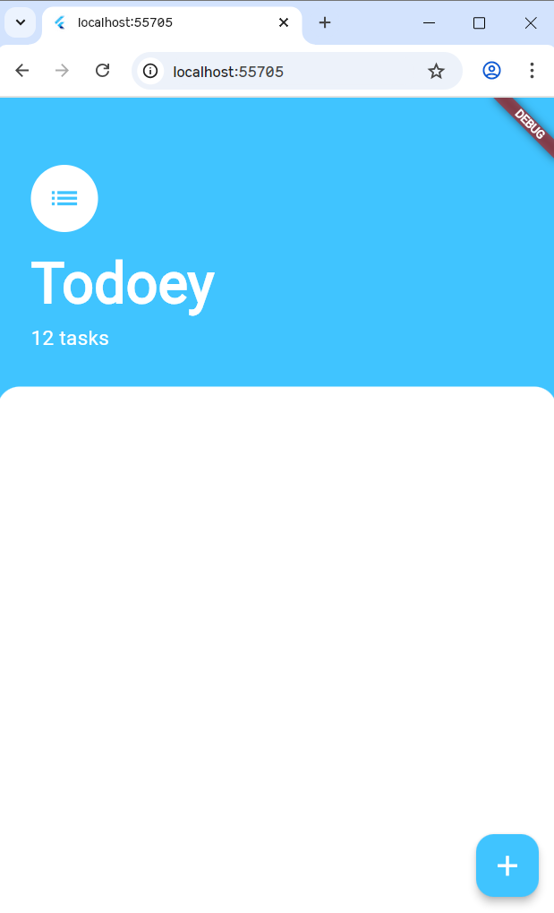

# 주차 기록

날짜: 2025년 12월 3일
진도: Section 16: 195~200
키워드: toy project 1

<aside>


**What’s the point?**

TODO 리스트 어플리케이션의 프로젝트 생성부터 상태 관리의 전 과정을 학습!

---

</aside>

# 👗 Section 16 Flutter State Management

---

## 195. Todoey - Your very own To-Do List App

---

생략

---

## 196. Designing the To-Do List App

---

1️⃣ `task_screen.dart`를 `lib/screens` 폴더에 생성 후 `main.dart` 에서 import

```dart
import 'package:flutter/material.dart';
**import 'package:todoey/screens/tasks_screen.dart';**

void main() => runApp(MyApp());

class MyApp extends StatelessWidget {
  @override
  Widget build(BuildContext context) {
    **return MaterialApp(
      home: TasksScreen(),
    );**
  }
}
```

+ `tasks_scree.dart`에 `Scaffold` 위젯

2️⃣ `Scaffold`의 자식: `Column` 위젯으로 list 아이콘, ‘Todoey’ 텍스트 넣기

1 ) 좌측 정렬을 맞추기 위해 `crossAxisAlignment: CrossAxisAlignment.start` 추가

2 ) 아이콘에 둥근 원을 감싸주기 위해 `CircleAvatar` 위젯으로 감싸줌

3 ) Todoey 텍스트와 아이콘 사이를 띄워 주기 위해 `SizedBox` 위젯에 `height`을 줌

3️⃣ `Column` 위젯 안의 요소들이 화면으로부터 일정 간격 떨어져 있어야 하므로 `Container` 위젯으로 감싸서 해당 위젯에 `padding`을 줌

4️⃣ `Coulmn`안의 요소들 아래 하얀색 박스가 있어야 하므로 `Container`를 이용하여 나타내 준다

1 ) `BoxDecoration`을 이용하여 Container을 커스텀 해준다

2 ) Container가 화면 끝까지 쭉 뻗어야 하므로 `Expanded`으로 박스를 늘려줌

5️⃣ 아이콘, 타이틀과 하얀색 박스를 구분해 주어야 박스에 padding이 적용되지 않는다 ⇒ `Column`으로 `Container`와 `Expanded`을 감싸줌

6️⃣ 부모 `Column`에도 좌측 정렬을 위해 `crossAxisAlignment: CrossAxisAlignment.start`을 추가

7️⃣ 플로팅 버튼을 `Scaffold` 위젯에 추가해 준다

1 ) 색상, 중앙에 더하기 아이콘을 넣어준다



```dart
// main.dart
import 'package:flutter/material.dart';
import 'package:todoey/screens/tasks_screen.dart';

void main() => runApp(MyApp());

class MyApp extends StatelessWidget {
  @override
  Widget build(BuildContext context) {
    return MaterialApp(
      home: TasksScreen(),
    );
  }
}
```

```dart
// lib/screens/tasks_screen.dart
import 'package:flutter/material.dart';

class TasksScreen extends StatelessWidget {
  @override
  Widget build(BuildContext context) {
    return Scaffold(
      backgroundColor: Colors.lightBlueAccent,
      floatingActionButton: FloatingActionButton(
        backgroundColor: Colors.lightBlueAccent,
        onPressed: () {  },
        child: Icon(
            Icons.add,
            color: Colors.white,
            size: 30.0,
        ),
      ),
      body: Column(
        crossAxisAlignment: CrossAxisAlignment.start,
        children: [
          Container(
            padding: EdgeInsets.only(top: 60.0, left: 30.0, right: 30.0, bottom: 30.0),
            child: Column(
              crossAxisAlignment: CrossAxisAlignment.start,
              children: <Widget> [
                CircleAvatar(
                  child: Icon(
                    Icons.list,
                    size: 30.0,
                    color: Colors.lightBlueAccent,
                  ),
                  backgroundColor: Colors.white,
                  radius: 30.0,
                ),
                SizedBox(height: 10.0),
                Text('Todoey',
                  style: TextStyle(
                    color: Colors.white,
                    fontSize: 50.0,
                    fontWeight: FontWeight.w700,
                  ),
                ),
                Text(
                  '12 tasks',
                  style: TextStyle(
                    color: Colors.white,
                    fontSize: 18.0,
                  ),
                ),
              ],
            ),
          ),
          Expanded(
            child: Container(
              decoration: BoxDecoration(
                  color: Colors.white,
                  borderRadius: BorderRadius.only(topRight: Radius.circular(20.0), topLeft: Radius.circular(20.0))
              ),
            ),
          )
        ],
      ),
    );
  }
}
```

---

## 197. The ListView Challenge

---

**: 하얀색 박스 `Container`에 To-Do List를 넣자!**

1️⃣ `Container`의 child로 `ListView` 위젯

2️⃣ `ListView`의 children으로 `ListTitle` 위젯

1 ) `ListTitle` 위젯에 `title`, `trailing` 추가!

2 ) `trailing` 에 `Checkbox`위젯을 통해 체크 박스 삽입

3️⃣ `ListTitle`의 위치가 위 Column의 아이콘, 타이틀과 맞지 않으므로 `Container`에 padding을 준다!

`padding: EdgeInsets.symmetric(vertical: 30.0, horizontal: 20.0),`

4️⃣ `ListView`  ⇒ `TasksList`, `ListTile` ⇒ `TaskTile` 로 리팩토링!


1 ) 리팩토링하면 아래에 `TasksList`, `TaskTile`위젯이 생긴다!

```dart
class TasksList extends StatelessWidget {
  @override
  Widget build(BuildContext context) {
    return ListView(
      children: <Widget>[
        TaskTile(),
        TaskTile(),
        TaskTile(),
      ]
    );
  }
}

class TaskTile extends StatelessWidget {
  @override
  Widget build(BuildContext context) {
    return ListTile(
      title: Text('This is a task'),
      trailing: Checkbox(
          value: false, onChanged: null,
      ),
    );
  }
}
```

2 ) `lib/widgets` 에 `tasks_list.dart`와 `tasks_tile.dart`를 추가하여 클래스를 옮긴다!

3 ) 오류 방지를 위해 import 해준다!

```dart
// tasks_screen.dart
.
.
.
          Expanded(
            child: Container(
              padding: EdgeInsets.symmetric(vertical: 30.0, horizontal: 20.0),
              decoration: BoxDecoration(
                  color: Colors.white,
                  borderRadius: BorderRadius.only(topRight: Radius.circular(20.0), topLeft: Radius.circular(20.0))
              ),
              // list view
              child: TasksList(),
            ),
          )
          
.
.
.
```

```dart
// widgets/tasks_list.dart
import 'package:flutter/material.dart';
import 'tasks_tile.dart';

class TasksList extends StatelessWidget {
  @override
  Widget build(BuildContext context) {
    return ListView(
        children: <Widget>[
          TaskTile(),
          TaskTile(),
          TaskTile(),
        ]
    );
  }
}
```

```dart
// widgets/tasks_tile.dart
import 'package:flutter/material.dart';

class TaskTile extends StatelessWidget {
  @override
  Widget build(BuildContext context) {
    return ListTile(
      title: Text('This is a task'),
      trailing: Checkbox(
        value: false, onChanged: null,
      ),
    );
  }
}
```


---

## 198. The BottomSheet Widget

---

**: `showModalBottomSheet`을 통해 화면 아래 팝업을 만들자!**

1️⃣ `FloatingActionButton`의 `onPressed` 에 `showModalBottomSheet` 함수를 추가

2️⃣ `showModalBottomShttet` 에 `context`와 `builder`를 부여한다

1 ) `context` 는 지금까지의 context

2 ) `builder`에는 Bottom Sheet을 나타내기 위한 함수 필요!

```dart
class TasksScreen extends StatelessWidget {

  Widget buildButtomSheet(BuildContext context) {
    return Container(
      child: Center(
        child: Text('This is Bottom Sheet'),
      )
    );
  }
  .
  .
  .
```


3️⃣ anonymous 함수로 builder에 함수 부여하기

1 ) arrow function

```dart
  Widget buildButtomSheet(BuildContext context) **=> Container();**
```

2 ) anonymous function

```dart
showModalBottomSheet(context: context, **builder: (BuildContext context) => Container()**);

```

4️⃣ `Container`대신 `AddTaskScreen()` 함수를 불러오도록 함

1 ) `lib/screens` 에 `add_task_screen.dart` 생성, import

2 ) `add_task_screen.dart` 의 `AddTaskScreen` 클래스에 팝업 창 구현

5️⃣ 전체 `Container`에 색상, borderRadius 속성을 준다

6️⃣ `Container` 안 `Column`에 `Text`, `TextField`, `TextButton`을 차례로 구현!

1 ) `Text`

- 텍스트를 중앙에 배치

```dart
              Text(
                  'Add Task',
                  textAlign: TextAlign.center,
                  style: TextStyle(
                    color: Colors.lightBlueAccent,
                    fontSize: 30.0,
                )
              ),
```

2 ) `TextField`

- 플로팅 버튼을 누르자마자 텍스트 필드에 포커스 되어서 키보드가 나오게
- 텍스트 필드를 중앙에 배치

3 ) `TextButton`

<aside>
🚧

`FlatButton` 대신 사용해야 함!

---

[TextButton.new constructor - TextButton - material library - Dart API](https://api.flutter.dev/flutter/material/TextButton/TextButton.html)

```dart
const TextButton({
  super.key,
  required super.onPressed,
  super.onLongPress,
  super.onHover,
  super.onFocusChange,
  super.style,
  super.focusNode,
  super.autofocus = false,
  super.clipBehavior,
  super.statesController,
  super.isSemanticButton,
  required Widget super.child,
});
```

---

**Text Button에 색 넣기**

https://velog.io/@sharveka_11/Flutter-13.-TextButton

```dart
style: TextButton.styleFrom(
  backgroundColor: Colors.lightBlueAccent,
)
```

</aside>

- `addTask` 함수를 임의로 정의하여 `onPressed`에서 작동하게 함
    
    ```dart
      void addTask() {
        print('Add Task');
      }
    ```
    
    
    
- `TextButton.styleFrom`을 통해 border Radius와 background Color을 줌
- Text Button에 텍스트 추가

```dart
TextButton(
  onPressed: addTask,
  style: TextButton.styleFrom(
    shape: RoundedRectangleBorder(borderRadius: BorderRadius.circular(10.0)),
    backgroundColor: Colors.lightBlueAccent,
  ),
  child: Text(
    'Add',
    style: TextStyle(
      color: Colors.white,
    ),
  ),
),
```

7️⃣ `Column` 내의 각 요소 사이에 `SizedBox` 추가

8️⃣ `Column` 전체를 `Padding`으로 감싸기

```dart
// lib/screens/add_task_screen.dart
import 'package:flutter/material.dart';

class AddTaskScreen extends StatelessWidget {
  void addTask() {
    print('Add Task');
  }

  @override
  Widget build(BuildContext context) {
    return Container(
      color: Color(0xff757575),
      child: Container(
        decoration: BoxDecoration(
          color: Colors.white,
          borderRadius: BorderRadius.only(
            topLeft: Radius.circular(20.0),
            topRight: Radius.circular(20.0),
          )
        ),
        child: Padding(
          padding: const EdgeInsets.symmetric(horizontal: 60.0, vertical: 40.0),
          child: Column(
            crossAxisAlignment: CrossAxisAlignment.stretch,
            children: <Widget> [
              Text(
                  'Add Task',
                  textAlign: TextAlign.center,
                  style: TextStyle(
                    color: Colors.lightBlueAccent,
                    fontSize: 30.0,
                )
              ),
              SizedBox(height: 10.0),
              TextField(
                autofocus: true,
                textAlign: TextAlign.center,
              ),
              SizedBox(height: 20.0),
              TextButton(
                onPressed: addTask,
                style: TextButton.styleFrom(
                  shape: RoundedRectangleBorder(borderRadius: BorderRadius.circular(10.0)),
                  backgroundColor: Colors.lightBlueAccent,
                ),
                child: Text(
                  'Add',
                  style: TextStyle(
                    color: Colors.white,
                  ),
                ),
              ),
            ],
          ),
        ),
      ),
    );
  }
}
```

---

## 199. Positioning the BottomSheet above the KeyBoard

---

- 기본적으로 `BottomSheet`는 스크린의 반을 차지하게 되어 있음
- `BottomSheet`가 전체 화면을 차지하게 하려면 `isScrolledControlled` 속성을 `true`로 설정하면 된다!
    
    ```dart
    onPressed: () {
    	showModalBottomSheet(
    		context: context,
    		**isScrollControlled: true,**
    		builder: (context) => AddTaskScreen(),
    	);
    }
    ```
    
- `AddTaskScreen`을 키보드 위에 띄우려면, `SingleChildScrollView`를 통해 감싸면 됨!
    
    ```dart
    onPressed: () {
    	showModalBottomSheet(
    		context: context,
    		isScrollControlled: true,
    		builder: (context) => **SingleChildScrollView(
    			child: Container(
    				padding: EdgeInsets.only(
    					bottom: MediaQuery.of(context).viewInsets.bottom
    				),**
    				**child:** AddTaskScreen(),
    			**)
    		)**
    	);
    }
    ```
    

---

## 200. What is State and How do we Manage it?

---

<aside>

### 🥽 What Is State?

---

**: 애플리케이션의 UI를 다시 그리기 위해 유지해야 하는 데이터**

```dart
return ListTile(
  title: Text('This is a task'),
  trailing: Checkbox(
    **value: false,**
    onChanged: null,
  ),
);
```

여기서 `value`가 사용자에게 보여지는 체크 박스를 결정함!

⇒ `value`를 자동으로 바꾸기 위해서 `isChecked` 변수를 사용하자!

⇒ `isChecked` 값이 바뀌면 `value`가 바뀌고, UI를 업데이트

---

### 👔 State의 종류

**Local State**

---

: 특정 위젯 안에서만 필요하고, 그 위젯이 사라지면 같이 사라져도 되는 상태

- UI의 특정 부분 (단일 위젯)에만 영향을 미치는 상태 → 다른 위젯이나 화면에서는 이 데이터를 알 필요 없음!
- `StatefulWidget`과 `setState()`으로 관리

**Global State**

---

: 애플리케이션의 여러 곳에서 공유되거나, 세션 내내 유지되어야 하는 상태

- 애플리케이션 전체, 혹은 서로 멀리 떨어진 여러 위젯 간에 공유되어야 하는 데이터

</aside>

---

**Local State**

1️⃣ `Checkbox`위젯을 `TaskCheckbox`로 리팩토링

**2️⃣ 생성된 클래스를 `StatefulWidget`으로 변경!**

3️⃣ 화면에 체크 박스의 변화를 보여주기 위해 `value: isChecked`와 새로운 boolean 변수 `isChecked` 추가!

4️⃣ 사용자가 체크 박스를 체크하면 `newValue`가 바뀜!

⇒ **순환 구조**

1 ) 초기 상태: `isChecked = false`

2 ) 화면 그리기 (`build`): `Checkbox`는 `value`가 `false`이므로 빈 박스를 그림

3 ) 사용자 클릭: 사용자가 빈 박스를 누름

4 ) 이벤트 발생 (`onChanged`): `newValue`에 `true`를 담아 함수를 실행

5 )  상태 변경 (`setState`): 

```dart
setState(() {
  isChecked = newValue!;
});
```

6 ) 화면 다시 그리기 (`re-build`): `setState`가 호출되었으므로 `build` 함수를 다시 실행

7 ) 업데이트: `Checkbox`의 `value`는 `true`가 되고, 체크된 박스가 화면에 그려짐

```dart
// task_tile.dart
import 'package:flutter/material.dart';

class TaskTile extends StatelessWidget {
  @override
  Widget build(BuildContext context) {
    return ListTile(
      title: Text('This is a task'),
      trailing: TaskCheckbox(),
    );
  }
}

class TaskCheckbox extends StatefulWidget {
  @override
  State<TaskCheckbox> createState() => _TaskCheckboxState();
}

class _TaskCheckboxState extends State<TaskCheckbox> {
  bool isChecked = false;

  @override
  Widget build(BuildContext context) {
    return Checkbox(
      activeColor: Colors.lightBlueAccent,
      value: isChecked,
      onChanged: (newValue) {
        setState(() {
          isChecked = newValue!;
        });
      },
    );
  }
}
```

---

**State Lifting**

⇒ 자식 위젯 (`TaskCheckbox`)은 스스로 상태를 가지지 않는 StatelessWidge임! 대신 부모 (`TaskTile`)가 상태를 가지고 있다가, 자식이 필요로 할 때 생성자를 통해 데이터 전달

1 ) 빌드: `TaskTile`이 빌드되면서 `isChecked`의 현재 값(`false`)을 `TaskCheckbox`에게 전달 + 동시에 `checkboxCallback`이라는 함수도 전달

2 ) 사용자 액션: 사용자가 화면의 체크 박스를 누름

3 ) 이벤트 발생:

- `TaskCheckbox` 내부의 `Checkbox` 위젯에서 `onChanged` 이벤트 발생
- 이때 `TaskCheckbox`는 전달받았던 `toggleCheckboxState` 함수 실행

4 ) 콜백 실행: 위로 전달!

- `toggleCheckboxState`는 사실 부모인 `_TaskTileState`에 정의된 `checkboxCallback`
- 자식의 클릭 신호가 부모에게 전달

5 ) 상태 변경

- `checkboxCallback` 내부에서 `setState` 가 실행
- 이때 `isChecked` 변수의 값이 `true` 또는 `false`로 업데이트
- `setState`로 인해 화면이 다시 그려짐

6 ) 화면 갱신

- `_TaskTileState`의 `build` 메소드가 다시 실행
- 변경된 `isChecked` 값을 가지고 `Text` 위젯과 `TaskCheckbox`가 다시 그려짐

| `_TaskTileState`  | 실제 데이터(`isChecked`)를 소유하고 변경하는 권한(`setState`)을 가짐 |
| --- | --- |
| `TaskCheckbox` | 데이터가 무엇인지 모르며, 부모가 시키는 대로 보여주고 클릭되면 부모에게 알리기만 함 |
| `Callback` | 자식(UI)에서 발생한 이벤트를 부모(Logic)에게 전달하는 통로 |

```dart
// tasks_tile.dart
import 'package:flutter/material.dart';

class TaskTile extends StatefulWidget {
  @override
  State<TaskTile> createState() => _TaskTileState();
}

class _TaskTileState extends State<TaskTile> {
  bool isChecked = false;

  void checkboxCallback  (bool? checkboxState) {
    setState(() {
      isChecked = checkboxState ?? false;
    });
  }

  @override
  Widget build(BuildContext context) {
    return ListTile(
      title: Text(
        'This is a task',
        style: TextStyle(
            decoration: isChecked ? TextDecoration.lineThrough : null
        ),
      ),
      trailing: TaskCheckbox(isChecked, checkboxCallback),
    );
  }
}

class TaskCheckbox extends StatelessWidget {

  final bool checkboxState;
  final void Function(bool?) toggleCheckboxState;

  TaskCheckbox(this.checkboxState, this.toggleCheckboxState);

  @override
  Widget build(BuildContext context) {
    return Checkbox(
      activeColor: Colors.lightBlueAccent,
      value: checkboxState,
      onChanged: toggleCheckboxState,
    );
  }
}
```

